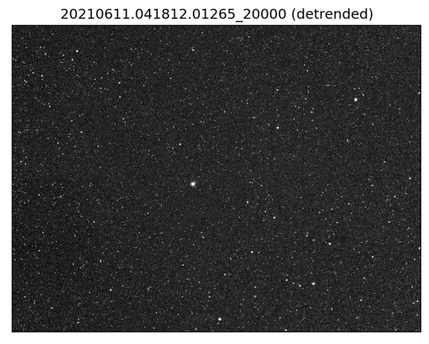
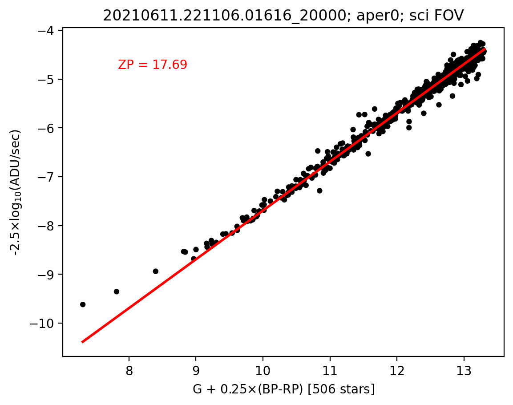

# pointing_camera

This pointing camera reduction/analysis pipeline is implemented in pure Python. It has a relatively small number of dependencies that must be installed (see requirements.txt).

It also requires Gaia catalog files accessed via an environment variable called `PC_GAIA_DIR` and a static bad pixel mask accessed via an environment variable called `POINTING_CAMERA_META` that points to a directory for ancillary calibration products.

Here is an example invocation for running the full pipeline:

    python -u pc_proc.py /global/cfs/cdirs/desi/users/ameisner/pointing_camera/nino/20191103.234228.00498_03000.fits --outdir 20191103

This produces the following output files:

    20191103/20191103.234228.00498_03000-detrended.fits
    20191103/20191103.234228.00498_03000-summary.fits
    20191103/20191103.234228.00498_03000-zp.png

* The -detrended.fits output is a detrended version of the raw pointing camera image.
* The -summary.fits output is a multi-extension FITS file containing:
  * The `CATALOG` HDU, a source catalog with centroids and fluxes.
  * The `ZEROPOINTS` HDU, a summary table of zeropoints (for several apertures and different image regions).
  * The `SKY` HDU, a summary table of sky brightness measurements.

```
    Filename: 20191103/20191103.234228.00498_03000-summary.fits
    No.    Name      Ver    Type      Cards   Dimensions   Format
      0  PRIMARY       1 PrimaryHDU      33   ()
      1  CATALOG       1 BinTableHDU    169   2785R x 65C   [K, D, D, E, E, E, E, I, E, E, I, E, E, I, E, I, I, E, E, L, E, E, E, E, E, E, E, L, E, E, D, D, D, D, D, D, D, K, L, D, D, D, D, D, D, D, D, D, D, D, D, D, D, D, D, 7D, K, E, E, K, D, 7D, 7D, I, K]
      2  ZEROPOINTS    1 BinTableHDU     60   35R x 11C   [K, K, D, K, D, E, E, D, 91A, D, 8A]
      3  SKY           1 BinTableHDU     90   1R x 26C   [E, D, E, D, D, 91A, E, D, E, D, E, D, E, D, E, D, E, D, E, D, E, D, E, D, D, 8A]
```

* The -zp.png output is a checkplot comparing the pointing camera instrumental mags to Gaia mags.

## detrending example



## photometric zeropoint checkplot example



# full help for running the pipeline

    pointing_camera/py/pointing_camera> python pc_proc.py --help

    usage: pc_proc.py [-h] [--outdir OUTDIR] [--dont_write_detrended] [--skip_checkplot] [--nightly_subdir] [--send_redis] [--one_aper]
                      [--bg_sigclip] [--multiproc MULTIPROC] [--max_n_stars MAX_N_STARS] [--pm_corr] [--skip_flatfield]
		      [--sci_inst_name SCI_INST_NAME] [--sci_fov_checkplot] [--check_tcs_motion] [--detect_streaks] [--plot_detrended]
		      [--plot_streaks] [--plot_quiver]
                      fname_in

    run the pointing camera reduction pipeline on an exposure

    positional arguments:
      fname_in              pointing camera raw image file name

    optional arguments:
      -h, --help            show this help message and exit
      --outdir OUTDIR       directory to write outputs in
      --dont_write_detrended
                            don't write detrended image
      --skip_checkplot      don't create a checkplot
      --nightly_subdir      create output subdirectories per observing night
      --send_redis          send results to redis
      --one_aper            only do aperture photometry for one aperture size
      --bg_sigclip          sigma clipping for background annulus median
      --multiproc MULTIPROC
                            number of threads for multiprocessing
      --max_n_stars MAX_N_STARS
                            limit analysis to brightest max_n_stars Gaia stars
      --pm_corr             make Gaia proper motion corrections based on MJD
      --skip_flatfield      skip flatfielding during pixel-level detrending
      --sci_inst_name SCI_INST_NAME
                            name of science instrument
      --sci_fov_checkplot   restrict checkplot to science instrument FOV
      --check_tcs_motion    abort reductions based on telescope motion flag
      --detect_streaks      run satellite streak detection/cataloging
      --plot_detrended      make and save plot of detrended image
      --plot_streaks        overplot detected streaks on detrended image
      --plot_quiver         make and save quiver plot of centroid shifts

# Redis telemetry

| field                | description |
| -------------------- | ----------- |
| timestamp            | KPNO local time formatted like "2021-06-21/22:13:35/MST/"                        |
| zp_adu_per_s         | photometric zeropoint in Gaia-like magnitudes, entire image (1 ADU/s source)     |
| sky_adu_per_s        | sky brightness in ADU/s/pix, entire image                                        |
| mjd_obs              | MJD at start of exposure                                                         |
| n_stars_for_zp       | number of stars used to determine the zeropoint, entire image                    |
| sky_adu_per_s_q1     | sky brightness in ADU/s/pix, image quadrant 1                                    |
| sky_adu_per_s_q2     | sky brightness in ADU/s/pix, image quadrant 2                                    |
| sky_adu_per_s_q3     | sky brightness in ADU/s/pix, image quadrant 3                                    |
| sky_adu_per_s_q4     | sky brightness in ADU/s/pix, image quadrant 4                                    |
| zp_adu_per_s_q1      | photometric zeropoint in Gaia-like magnitudes, image quadrant 1 (1 ADU/s source) |
| zp_adu_per_s_q2      | photometric zeropoint in Gaia-like magnitudes, image quadrant 2 (1 ADU/s source) |
| zp_adu_per_s_q3      | photometric zeropoint in Gaia-like magnitudes, image quadrant 3 (1 ADU/s source) |
| zp_adu_per_s_q4      | photometric zeropoint in Gaia-like magnitudes, image quadrant 4 (1 ADU/s source) |
| n_stars_for_zp_q1    | number of stars used to determine the zeropoint in image quadant 1               |
| n_stars_for_zp_q2    | number of stars used to determine the zeropoint in image quadant 2               |
| n_stars_for_zp_q3    | number of stars used to determine the zeropoint in image quadant 3               |
| n_stars_for_zp_q4    | number of stars used to determine the zeropoint in image quadant 4               |
| sky_adu_per_s_desi   | sky brightness in ADU/s/pix (DESI FOV only)                                      |
| zp_adu_per_s_desi    | photometric zeropoint in Gaia-like magnitudes, DESI FOV only (1 ADU/s source)    |
| n_stars_for_zp_desi  | number of stars used to determine the zeropoint DESI FOV only                    |
| flag                 | dome vignetting flag; 1 = dome (bad), 0 = no dome (good)                         |
